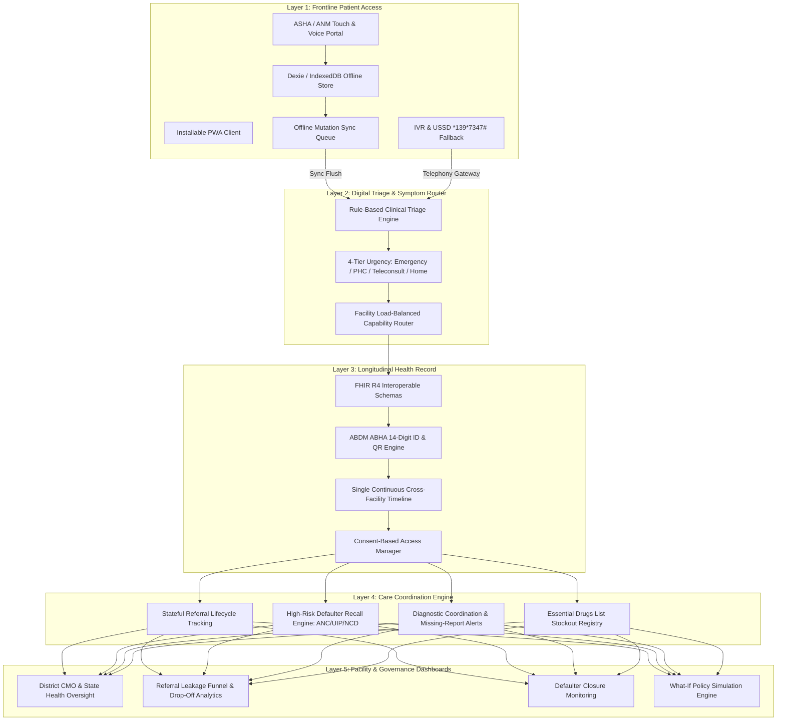

# PFIS Technical Architecture & System Design
### 5-Layer Offline-First Care-Access & Continuity Platform for Rural & Underserved Public Healthcare
**Smart India Hackathon (SIH) 2026**

---

## 1. Executive Summary & Core Mandate

The **Patient Friction Intelligence System (PFIS)** is an integrated care-access, quality-support, and care-continuity platform purpose-built for India's public health hierarchy (Sub-Centres / Ayushman Arogya Mandirs → Primary Health Centres → Community Health Centres / FRUs → District Hospitals).

### The Guiding Design Principles
1. **Strengthen, Don't Replace**: Every module layers directly on top of existing national health infrastructure (**ABDM/ABHA**, **e-Sanjeevani**, **HMIS**), never creating parallel or competing systems.
2. **Offline-First by Default**: Assumes zero or intermittent connectivity as the normal operating case through local IndexedDB caching and an asynchronous mutation outbox queue.
3. **Frontline-Worker-Centered UX**: Designed first for ASHA/ANM health workers with audio/icon-assisted interfaces and vernacular language synthesis.
4. **Interoperability over Lock-in**: All clinical and referral data structures conform natively to **FHIR R4** and **ABDM** standards.
5. **Consent-Based Access**: Longitudinal records are shared across facilities exclusively through explicit, time-bound, auditable patient consent tokens.
6. **Stateful Tracking**: Every referral, lab request, and follow-up recall is a tracked state machine (`initiated → accepted → in-transit → completed`), guaranteeing that **nothing falls through the cracks**.

---

## 2. 5-Layer Solution Architecture

---

## 3. Layer Specifications

### Layer 1: Frontline Patient Access
- **Offline PWA Architecture**: Built with Vite PWA and service worker caching for offline app shell execution.
- **Client Storage**: `client/src/offline/db.ts` uses Dexie.js (IndexedDB) for storing offline patient registrations, symptom assessments, and revisit tasks.
- **Sync Flusher**: `client/src/offline/syncManager.ts` listens to `online` network recovery events and flushes the queued mutations to `POST /api/sync/flush`.
- **Zero-Connectivity Fallback**: Detailed in `docs/FALLBACK_IVR_USSD.md`, providing toll-free IVR dialing and USSD shortcode `*139*7347#` routing for feature phones.

### Layer 2: Digital Triage & Symptom Router
- **Clinical Protocols**: `server/src/intelligence/triage/clinicalTriageEngine.ts` implements:
  - **IMNCI** pediatric triage guidelines (<5 years).
  - **Maternal Health** danger signs (antepartum hemorrhage, severe pre-eclampsia, convulsions).
  - **Acute Cardiovascular & Stroke** red flags.
  - **Chronic NCDs** (hypertension, diabetes mellitus).
- **4-Tier Urgency Matrix**:
  1. `EMERGENCY_108`: Immediate ambulance dispatch to District Hospital / FRU emergency bed.
  2. `PHC_VISIT`: Scheduled in-person evaluation with digital queue token.
  3. `TELECONSULT`: Assisted e-Sanjeevani consultation at Sub-Centre without patient travel.
  4. `SELF_CARE`: Home hydration and guidance with 48-hour ASHA remote follow-up.

### Layer 3: Longitudinal Health Record (Continuity Backbone)
- **FHIR R4 Resources**: Conforms to FHIR R4 in `server/src/fhir/fhirTypes.ts`:
  - `FHIRPatient`, `FHIREncounter`, `FHIRCondition`, `FHIRServiceRequest`, `FHIRCarePlan`.
- **ABDM Integration**: `server/src/services/abhaService.ts` generates:
  - 14-digit ABHA Number: `XX-XXXX-XXXX-XXXX`
  - ABHA Address: `patient@abdm`
  - Cryptographically signed QR code conforming to National Health Authority (NHA) specifications.
- **Continuous Timeline**: Tracks patient encounters seamlessly from village Sub-Centre to Primary Health Centre to District Hospital.

### Layer 4: Care Coordination Engine
- **Stateful Referral Tracking**: Managed in `server/src/controllers/referralController.ts`. Referrals are state machines:
  $$\text{initiated} \longrightarrow \text{accepted} \longrightarrow \text{in-transit} \longrightarrow \text{consulted} \longrightarrow \text{counter-referred}$$
  Each state transition logs actor, facility, timestamp, and clinical notes.
- **High-Risk Recall Engine**: Managed in `server/src/intelligence/recall/highRiskRecallEngine.ts`. Scans:
  - Maternal ANC (4 mandatory checkups + IFA compliance)
  - Universal Immunization Programme (Birth to 24 months)
  - Chronic NCD monthly refill adherence
  Automatically generates actionable ASHA revisit tasks when appointments are overdue.
- **Essential Medicine Inventory**: Managed in `server/src/controllers/medicineInventoryController.ts`, providing real-time stockout tracking for essential public health drugs.

### Layer 5: Facility & Governance Dashboards
- **District Health Telemetry**: Managed in `client/src/pages/admin/AdminDashboard.tsx`, presenting:
  - Referral completion rate (%)
  - High-risk defaulter resolution rate (%)
  - Medicine stockout alarms
  - Teleconsultation volumes and travel kilometers avoided.

---

## 4. End-to-End MVP Flows

1. **Flow 1: ASHA-Assisted Offline Registration + Triage**:
   - ASHA worker registers patient offline at the doorstep.
   - Runs audio/icon-guided symptom triage.
   - System recommends routing; record is stored locally and syncs automatically when online.
2. **Flow 2: Cross-Facility Stateful Referral**:
   - PHC Doctor logs clinical findings and creates a stateful referral to District Hospital.
   - District Hospital referral reception accepts referral, reserves bed/specialist, and scans ABHA QR code to view longitudinal history.
   - Specialist counter-refers patient back to PHC with follow-up protocol.
3. **Flow 3: High-Risk Follow-Up & Defaulter Recall**:
   - Automated protocol engine identifies an overdue checkup (e.g. 3rd ANC visit for Sunita Devi).
   - Generates high-priority recall task in ASHA Anita Devi's mobile queue.
   - ASHA logs home visit and reschedules appointment, closing the care loop.
