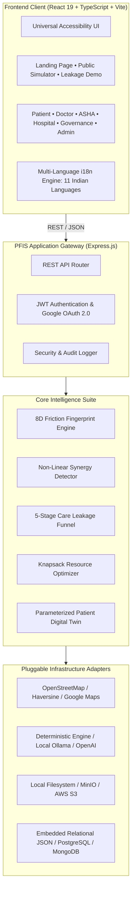

# Patient Friction Intelligence System (PFIS)

<div align="center">


### Non-Clinical Healthcare Accessibility & Friction Intelligence Platform

**An enterprise-grade, open-source platform for modeling, measuring, visualizing, and simulating the non-clinical barriers that prevent patients from completing healthcare journeys.**

[](https://github.com/satyamhq/Patient-Friction-Intelligence-System/actions/workflows/ci.yml)
[](https://opensource.org/licenses/MIT)
[](https://www.typescriptlang.org/)
[](https://react.dev/)
[](https://vitejs.dev/)
[](https://nodejs.org/)
[](https://vercel.com/)
[](./docker-compose.yml)
[](./server/tests/)
[](./data/README.md)

[Live Interactive Demo](https://pfis-sih.vercel.app) • [Architecture Guide](./docs/architecture.md) • [Intelligence Engine](./docs/intelligence-engine.md) • [Getting Started](./docs/getting-started.md) • [API Reference](./docs/api.md)

</div>

---

## 📑 Table of Contents

- [The Problem We Solve](#-the-problem-we-solve)
- [Core Platform Capabilities](#-core-platform-capabilities)
- [The 8 Dimensions of Healthcare Friction](#-the-8-dimensions-of-healthcare-friction)
- [Care Leakage Funnel & Synergies](#-care-leakage-funnel--compounding-synergies)
- [System Architecture](#-system-architecture)
- [Operational Portals Ecosystem](#-operational-portals-ecosystem)
- [Quick Start (Local Development)](#-quick-start-local-development)
- [Deploying to Vercel](#-deploying-to-vercel)
- [Deploying with Docker](#-deploying-with-docker)
- [Pluggable Adapters & Offline AI](#-pluggable-adapters--offline-ai)
- [Synthetic Data Pipeline](#-synthetic-data-pipeline)
- [API & OpenAPI 3.0](#-api--openapi-30)
- [Testing & Quality Assurance](#-testing--quality-assurance)
- [Ethical Safety & Privacy Mandate](#-ethical-safety--privacy-mandate)
- [Contributing & Roadmap](#-contributing--roadmap)
- [License](#-license)

---

## 🎯 The Problem We Solve

Traditional healthcare management systems ask:
> *"Is medical care physically available?"* (Do we have doctors, physical hospital beds, and pharmaceutical formulary?)

Yet across rural, underserved, and vulnerable communities, up to **74% of patient dropouts occur before a clinical consultation ever takes place**, driven by invisible **non-clinical friction**:

```
Traditional EMR View:
  Patient ──────────────────────────────► Hospital Consultation ──► Complete (Assumed)

Reality (PFIS Healthcare Journey):
  Referral ───► Consultation ───► Diagnostics ───► Treatment ───► Follow-Up
     │               │                │               │              │
     ▼               ▼                ▼               ▼              ▼
  Transit         Wage Loss       Paperwork      Wait Fatigue   Affordability
  Barrier          Barrier         Barrier         Barrier         Barrier
 (Dropout)        (Dropout)       (Dropout)       (Dropout)       (Dropout)
```

1. **Transit & Distance Deficits (36%)**: Inadequate rural bus schedules, distant tertiary hubs, or prohibitive travel fares.
2. **Daily Wage Loss (21%)**: Informal laborers who cannot surrender a full day of food income for morning OPD lines.
3. **Documentation Hurdles**: Missing identification or unverified scheme paperwork (e.g., Ayushman Bharat / PM-JAY).
4. **Digital Exclusion**: Vulnerable citizens and feature-phone users unable to navigate smartphone apps or scan digital tokens.
5. **Linguistic & Communication Gaps**: Vernacular disconnects with urban clinical staff leading to missed follow-ups.

**PFIS turns these invisible barriers into a rigorous, quantitative operational intelligence layer**, enabling health authorities and hospital systems to identify care leakage, simulate counterfactual interventions, and allocate budgets for maximum care completion.

---

## ⚡ Core Platform Capabilities

- **8-Dimensional Patient Friction Fingerprint (8D)**: Holistic multi-vector barrier assessment capturing travel distance, transit reliability, out-of-pocket costs, opportunity costs, scheme documentation, digital accessibility, linguistic alignment, and scheduling availability.
- **Compounding Synergy Matrix**: Evaluates non-linear barrier amplification where multiple concurrent deficits create superlinear abandonment hazards (e.g., transit deficit $\times$ daily wage loss).
- **What-If Intervention Simulator**: Real-time counterfactual policy modeling demonstrating how interventions (such as community transport shuttles, mobile diagnostic units, or ASHA navigators) boost care completion rates.
- **Constrained Knapsack Optimizer**: Mathematical solver determining the optimal mix of operational interventions to maximize population completion under fixed monetary budget constraints.
- **5-Stage Care Leakage Markov Funnel**: Longitudinal tracking from referral to follow-up adherence, surfacing exact drop-off points.
- **Additive Barrier Attribution**: Fully explainable, mathematically auditable barrier decomposition (no black-box predictions).
- **Geospatial Population Friction Heatmap**: OpenStreetMap-powered spatial clustering identifying geographic care deserts and transport vulnerabilities.

---

## 🔬 The 8 Dimensions of Healthcare Friction

Every patient journey is analyzed across eight fundamental friction axes:

| Dimension | Scope & Impact | Measurement Unit |
|:---|:---|:---|
| **1. Physical Distance** | Road travel distance between patient habitation and recommended care facility | Kilometers (km) via Haversine / OSM |
| **2. Transit Accessibility** | Public bus availability, transfer count, road quality, and terrain index | Transit Reliability Score (0–100) |
| **3. Financial Out-of-Pocket** | Direct transportation cost, diagnostic co-pays, and ancillary expenses | Currency (INR / USD) |
| **4. Opportunity / Wage Cost** | Lost daily wages and forgone livelihood required to seek care | Hours spent $\times$ daily wage rate |
| **5. Documentation & Scheme** | Status of health ID (ABHA), identity cards, and cashless scheme enrollments | Verification Stage Index (0–100) |
| **6. Digital Literacy** | Capability to use mobile smartphones, SMS reminders, or biometric scanners | Digital Literacy Tier (0–100) |
| **7. Language & Communication** | Primary vernacular compatibility with treating hospital facility | Dialect Match Coefficient (0–100) |
| **8. Scheduling & Queue Burden** | Facility OPD wait times, queue delays, and operational clinic hours | Minutes in queue / operational clash |

### Care Failure Probability Model

PFIS computes care abandonment risk using a calibrated logistic response curve:

$$P(\text{abandonment}) = \frac{1}{1 + e^{-k(F - F_0)}}$$

Where:
- $F$ is the aggregate compounded friction score ($0 \le F \le 100$).
- $F_0$ is the inflection threshold where barrier intensity overwhelms patient agency (default: $50$).
- $k$ is the sensitivity steepness constant ($k = 0.08$).

---

## 🔄 Care Leakage Funnel & Compounding Synergies

```
[ Cohort: 1,000 Referred Patients ]
   │
   ├── [Stage 1: Transit & Distance] ───────► 210 Dropped (Transit Deficit)
   ▼
[ 790 Arrived at Consultation ]
   │
   ├── [Stage 2: Queue & Registration] ─────► 140 Dropped (Lost Wages / Wait Times)
   ▼
[ 650 Consulted by Doctor ]
   │
   ├── [Stage 3: Diagnostics & Labs] ───────► 190 Dropped (Missing Docs / Fees)
   ▼
[ 460 Began Active Treatment ]
   │
   ├── [Stage 4: Medication & Care] ────────► 120 Dropped (Stockouts / Affordability)
   ▼
[ 340 Completed Prescribed Regimen ] ──► (34.0% Overall Completion Rate)
```

When barriers intersect, their cumulative impact is superlinear. PFIS detects compounding synergies:

```
Combined Risk = Friction_A + Friction_B + (Friction_A × Friction_B × Synergy_Weight)
```

Example: A patient facing both **High Transit Deficit** and **Daily Wage Sensitivity** drops out at $2.4\times$ the rate of either factor alone.

---

## 🏛️ System Architecture



---

## 👥 Operational Portals Ecosystem

> **Zero-Login Open Access**: All operational portals, simulators, and intelligence tools are directly accessible with zero login or signup barriers. Switch between clinical, administrative, and frontline community views instantly.

| Persona | Operational Portal | Key Capabilities |
|:---|:---|:---|
| **Citizen & Patient** | `/patient/dashboard` | 8D barrier fingerprint check, nearby facility locator, OPD appointment tokens, and ABHA health card wallet. |
| **Clinical Physician** | `/doctor/dashboard` | OPD consultation queue, clinical notes with ICD codes, and longitudinal patient health records. |
| **Frontline ASHA Worker** | `/asha/dashboard` | Household health visit ledger, community barrier triage wizard, and maternal/child recall outreach. |
| **Hospital Facility Desk** | `/hospital/dashboard` | Facility queue management, essential medicine formulary, and inter-facility referral processing. |
| **District Governance** | `/government/dashboard` | District care leakage diagnostics, facility performance comparisons, and intervention policy modeling. |
| **Platform Administrator** | `/admin/dashboard` | System health telemetry, verification queues, role governance, and security audit logs. |

---

## 🚀 Quick Start (Local Development)

PFIS is designed for **instant zero-friction developer setup**. It includes an embedded relational JSON storage driver and deterministic math providers that run 100% offline without requiring external databases or paid API keys.

### Prerequisites

- **Node.js** >= 20.0.0
- **npm** >= 10.0.0

### Step-by-Step Installation

```bash
# 1. Clone the repository
git clone https://github.com/satyamhq/Patient-Friction-Intelligence-System.git
cd Patient-Friction-Intelligence-System

# 2. Install all dependencies (root, server, and client)
npm install

# 3. Start development servers concurrently
npm run dev
```

The platform is now running locally:
- **Client (Frontend)**: [http://localhost:5173](http://localhost:5173) (Explore simulators immediately without logging in)
- **Server (Backend API)**: [http://localhost:5000](http://localhost:5000)
- **API Health Endpoint**: [http://localhost:5000/api/health](http://localhost:5000/api/health)

---

## ☁️ Deploying to Vercel

The frontend is fully optimized for single-click deployment on **Vercel**:

### Option 1: Vercel Dashboard (Recommended)

1. Fork or push this repository to your GitHub account.
2. In the [Vercel Dashboard](https://vercel.com/new), select **Import Project** and choose `Patient-Friction-Intelligence-System`.
3. Vercel automatically detects the configuration via [`vercel.json`](./vercel.json):
   - **Framework Preset**: Vite
   - **Build Command**: `cd client && npm install && npm run build`
   - **Output Directory**: `client/dist`
4. Click **Deploy**. The platform will be live in under 60 seconds.

### Option 2: Vercel CLI

```bash
# Install Vercel CLI
npm install -g vercel

# Deploy directly from repository root
vercel --prod
```

---

## 🐳 Deploying with Docker

For self-hosted production deployments, run the entire containerized stack via Docker Compose:

```bash
# Start all containers in the background
docker compose up -d

# Verify container status
docker compose ps

# View unified application logs
docker compose logs -f

# Shut down the stack
docker compose down
```

The stack includes:
- **PFIS Web Client & API Gateway**: Port `5000` (API) & `5173` (Client)
- **Embedded Database Storage**: Persisted locally via Docker volumes

---

## 🔌 Pluggable Adapters & Offline AI

PFIS strictly adheres to open-source vendor neutrality. It never requires proprietary SaaS keys:

| Capability | Default (Free / Open-Source) | Local Offline LLM | Cloud Enterprise |
|:---|:---|:---|:---|
| **Geospatial & Distance** | OpenStreetMap + Local Haversine | — | Google Maps Distance Matrix |
| **Barrier Synthesis** | Deterministic Math Engine | Ollama (`llama3.2`) | OpenAI GPT-4o |
| **Document Storage** | Local Filesystem (`./uploads`) | MinIO S3 | AWS S3 / Cloudflare R2 |
| **Database Storage** | Embedded Relational JSON | PostgreSQL 16 | MongoDB Atlas |

### Running with Local Offline Ollama

```bash
# In server/.env
AI_PROVIDER=ollama
OLLAMA_BASE_URL=http://localhost:11434
OLLAMA_MODEL=llama3.2
```

---

## 📊 Synthetic Data Pipeline

PFIS operates under a **Synthetic Data First** philosophy. No Protected Health Information (PHI) is ever used or stored.

All seed datasets are deterministically generated using the Mulberry32 pseudo-random number generator (PRNG):

```bash
# Seed 500 deterministic synthetic patient journeys
npm run seed:demo

# Reset database to initial benchmark state
npm run reset:demo
```

Explore synthetic data schemas in [`data/examples/`](./data/examples/) and documentation in [`data/README.md`](./data/README.md).

---

## 📖 API & OpenAPI 3.0

PFIS includes a formal OpenAPI 3.0 specification at [`openapi/openapi.yaml`](./openapi/openapi.yaml).

### Core Public Endpoints (Zero Authentication Required)

| Method | Endpoint | Description |
|:---|:---|:---|
| `GET` | `/api/health` | System health, uptime, and active provider status |
| `GET` | `/api/demo/overview` | Aggregated population KPIs and baseline friction |
| `POST` | `/api/demo/simulate` | Execute what-if counterfactual intervention simulations |
| `GET` | `/api/demo/leakage` | Retrieve 5-stage Markov care leakage funnel statistics |
| `GET` | `/api/demo/friction-map` | Geospatial barrier coordinates and clustering |

See [`docs/api.md`](./docs/api.md) for full interactive endpoint documentation.

---

## 🧪 Testing & Quality Assurance

PFIS maintains strict type-safety and automated test coverage across its analytical engines:

```bash
# 1. Run unit test suite (Intelligence engines, providers, math models)
npm test

# 2. Run TypeScript strict typechecking (Client & Server)
npm run typecheck

# 3. Build production bundles
npm run build
```

---

## 🛡️ Ethical Safety & Privacy Mandate

1. **Non-Clinical Guarantee**: PFIS is strictly a non-clinical healthcare accessibility and administrative intelligence system. It does **not** diagnose medical conditions, provide clinical advice, or prescribe drugs.
2. **Zero PHI Collection**: All demo accounts, hospital rosters, and patient journeys are entirely synthetic.
3. **Transparent & Auditable**: Every friction score and optimization recommendation is deterministic, explainable, and reproducible without inscrutable machine learning models.

---

## 🤝 Contributing & Roadmap

We enthusiastically welcome contributions from software engineers, public health researchers, data scientists, and UX designers.

- [Contributing Guidelines](./CONTRIBUTING.md)
- [Code of Conduct](./CODE_OF_CONDUCT.md)
- [Security Policy](./SECURITY.md)
- [Architecture Specifications](./docs/architecture.md)
- [Future Milestones & Roadmap](./ROADMAP.md)

---

## 📄 License

This project is licensed under the [MIT License](./LICENSE).
